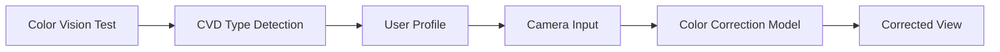
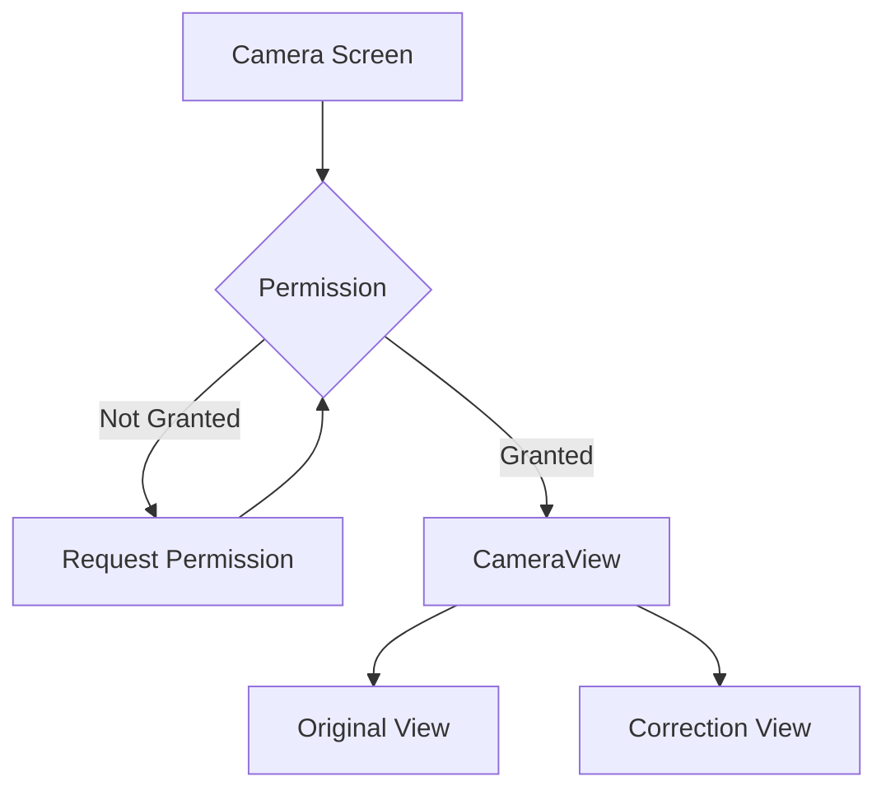
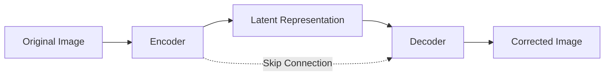
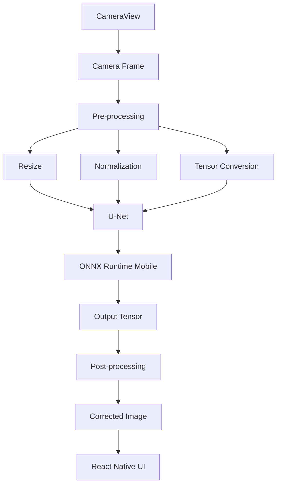
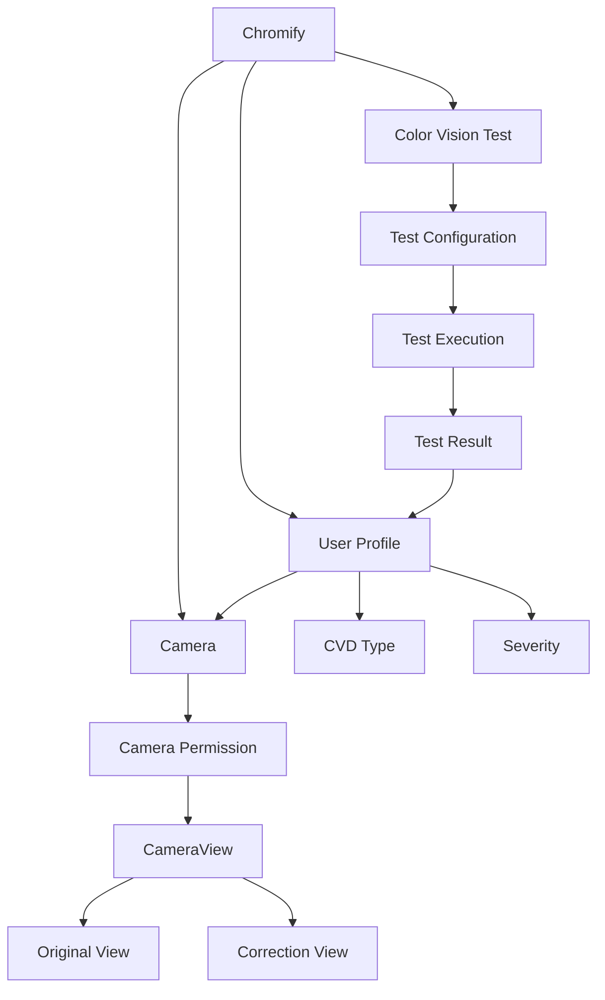

<div align="center">

# 🕶️ Chromify

### On-device Color Vision Deficiency Correction Camera

**색각 이상 사용자를 위한 개인 맞춤형 AI 색 보정 카메라 애플리케이션**

<br/>

`Computer Vision` · `U-Net` · `On-device AI` · `React Native` · `Expo`

<br/>

[Demo Video](https://youtu.be/Ufq5uxGSY2E)

</div>

---

## 📌 Overview

**Chromify**는 색각 이상(Color Vision Deficiency, CVD) 사용자가
일상 속에서 색을 보다 명확하게 구분할 수 있도록 돕는 **AI 기반 모바일 카메라 애플리케이션**입니다.

사용자의 색각 유형을 확인한 뒤,

* **Deutan**
* **Protan**
* **Tritan**
* **Mix**

등의 유형과 사용자별 `severity`를 관리하고, 이를 기반으로 개인화된 색 보정 경험을 제공하는 것을 목표로 개발했습니다.

단순한 이미지 필터를 적용하는 것이 아니라,

**색각 검사 → 사용자 프로필 → AI 색 보정 → 모바일 카메라**

로 이어지는 하나의 사용자 흐름을 설계했습니다.

---

## 🎬 Demo

<div align="center">

[](https://youtu.be/Ufq5uxGSY2E)

**이미지를 클릭하면 Demo Video를 확인할 수 있습니다.**

</div>

---

# 💡 Problem

색각 이상 사용자는 특정 색 조합의 차이를 구별하기 어려워
일상생활에서 색이 중요한 정보를 해석하는 데 불편함을 경험할 수 있습니다.

예를 들어,

* 신호 및 안내 표지
* 그래프와 데이터 시각화
* 의류 및 제품의 색상
* 지도 및 UI의 상태 표시
* 카메라를 통해 확인하는 주변 환경

등에서는 색 자체가 중요한 정보가 됩니다.

Chromify는 이러한 문제를

> **“사용자가 보는 카메라 화면 자체를 개인의 색각 특성에 맞게 보정할 수 없을까?”**

라는 문제로 정의했습니다.

---

# 🎯 Goal

Chromify가 목표로 하는 전체 서비스 흐름은 다음과 같습니다.



사용자가 자신의 색각 유형을 확인한 뒤 별도의 복잡한 설정 없이
카메라에서 바로 보정 결과를 사용할 수 있도록 구성하는 것이 목표입니다.

---

# ✨ Main Features

## 1. 👁️ Color Vision Test

사용자가 자신의 색각 특성을 확인할 수 있도록
색각 검사 과정을 앱 내부 Flow로 구성했습니다.

```text
Test Configuration
        ↓
Test Execution
        ↓
Test Result
        ↓
CVD Profile
```

프로젝트에는 다음과 같은 검사 화면이 구성되어 있습니다.

```text
test-config.tsx
      ↓
test-run.tsx
      ↓
test-result.tsx
```

별도의 `Ishihara test.py`를 통해 Ishihara Test 기반 색각 검사 로직도 실험했습니다.

---

## 2. 👤 Personalized CVD Profile

검사 결과를 기반으로 사용자의

```text
CVD Type
+
Severity
```

정보를 관리하도록 설계했습니다.

지원 대상으로 고려한 색각 유형은 다음과 같습니다.

| Type       | Description |
| ---------- | ----------- |
| **Deutan** | 녹색 계열 색각 이상 |
| **Protan** | 적색 계열 색각 이상 |
| **Tritan** | 청색 계열 색각 이상 |
| **Mix**    | 복합 색각 이상    |

카메라 화면에서는 사용자 Profile의

```ts
cvdType
severity
```

정보를 가져와 보정 설정에 활용할 수 있도록 구조를 구성했습니다.

---

## 3. 📷 Camera Interface

모바일 카메라는 **Expo Camera의 `CameraView`**를 이용하여 구현했습니다.

현재 구현된 기능은 다음과 같습니다.

* Camera Permission 요청
* Front / Back Camera 전환
* Camera Preview
* 사용자 CVD Type / Severity 연결
* 원본 / 보정 화면 비교 UI

카메라 권한을 확인한 뒤 CameraView를 실행하도록 구성했습니다.



---

## 4. ↔️ Original / Correction Comparison UX

사용자가 보정 효과를 직관적으로 비교할 수 있도록
Swiper 기반의 화면 구조를 적용했습니다.

```text
┌────────────────────┐
│                    │
│      Original      │
│       Camera       │
│                    │
└────────────────────┘
          ↔
┌────────────────────┐
│                    │
│     Corrected      │
│       Camera       │
│                    │
└────────────────────┘
```

좌우 Swipe를 통해 원본 화면과 보정 화면을 비교할 수 있도록 UI를 설계했습니다.

---

# 🧠 AI Approach

## Problem Formulation

Chromify의 색 보정 문제는

> **입력 이미지의 구조는 유지하면서 색상 표현만 사용자의 색각 특성에 맞게 변환하는 문제**

로 정의했습니다.

따라서 이를 **Image-to-Image Translation** 문제로 접근했습니다.

---

## 🧩 U-Net Color Correction

색 보정 모델에는 **U-Net 기반 구조**를 활용했습니다.



U-Net은 Encoder-Decoder 구조 사이의 **Skip Connection**을 통해
입력 이미지의 공간적인 정보를 유지하는 데 유리합니다.

Chromify에서는 이를 활용하여

* 객체 형태
* 이미지 구조
* 공간 정보

는 최대한 유지하면서,

**색상 표현을 변화시키는 방향의 Image-to-Image Translation**을 목표로 했습니다.

---

# 🗂️ Dataset

색각 이상 유형에 따른 색 변환 특성을 학습할 수 있도록
색 보정 모델 학습용 데이터를 구성했습니다.

기본적인 학습 데이터 구조는 다음과 같습니다.

```text
Original Image
       +
Target Corrected Image
       ↓
     U-Net
       ↓
Predicted Corrected Image
```

즉,

```text
Input  : Original RGB Image
Target : Corrected RGB Image
```

형태의 Pair를 이용해 원본 이미지와 목표 보정 이미지 사이의 변환 관계를 학습하는 방식입니다.

---

# 📱 On-device AI

Chromify는 최종적으로 서버에 이미지를 전송해 추론하는 구조보다
**모바일 기기 내부에서 직접 AI 모델을 실행하는 On-device AI 구조**를 목표로 했습니다.

---

## Why On-device?

실시간 Camera Application에서 매 프레임을 서버로 전송하면 다음과 같은 문제가 발생할 수 있습니다.

### Network Latency

실시간 카메라에서는 작은 지연도 사용자 경험에 큰 영향을 줄 수 있습니다.

### Privacy

사용자의 카메라 영상이 외부 서버에 지속적으로 전송될 수 있습니다.

### Network Dependency

인터넷 연결 상태에 따라 서비스 품질이 달라질 수 있습니다.

### Server Cost

지속적인 영상 추론은 높은 서버 연산 비용을 요구할 수 있습니다.

따라서 Chromify에서는

```text
Camera
   ↓
Local Processing
   ↓
AI Inference
   ↓
Corrected View
```

형태의 **Local Inference Architecture**를 고려했습니다.

---

# ⚙️ Target AI Inference Pipeline

학습한 색 보정 모델을 모바일 환경에서 사용할 수 있도록
ONNX 기반 배포 구조를 고려했습니다.



전체 목표 Pipeline은 다음과 같습니다.

```text
Camera Frame
     ↓
Resize / Normalize
     ↓
Tensor Conversion
     ↓
U-Net Inference
     ↓
ONNX Runtime Mobile
     ↓
Output Processing
     ↓
Corrected Camera View
```

이를 통해 서버 API 호출 없이 모바일 환경에서 직접 색 보정을 수행하는 구조를 목표로 했습니다.

---

# 🏗️ Application Architecture

Chromify의 전체 애플리케이션 구조는 크게 세 영역으로 나누어 설계했습니다.



---

# 📂 Repository Structure

```text
Chromify/
│
├── app/
│   ├── _layout.tsx
│   │
│   ├── index.tsx
│   │
│   ├── camera-loading.tsx
│   ├── camera.tsx
│   │
│   ├── test-config.tsx
│   ├── test-run.tsx
│   ├── test-result.tsx
│   │
│   └── modal.tsx
│
├── components/
│
├── hooks/
│
├── constants/
│
├── assets/
│
├── scripts/
│
├── Ishihara test.py
│
├── demo.mp4
│
└── README.md
```

---

# 🔍 Core Implementation

## Camera Permission

`useCameraPermissions()`를 이용하여 앱에서 Camera 권한을 확인합니다.

```text
Application
     ↓
Check Permission
     ↓
Permission Granted?
     ↓
CameraView
```

권한이 없는 경우 앱 내부에서 사용자에게 권한 요청 UI를 제공합니다.

---

## Camera Direction

Camera 상태를

```ts
front
back
```

두 가지로 관리하고 버튼을 이용하여 전면/후면 Camera를 변경할 수 있도록 구현했습니다.

---

## User Profile → Camera

카메라 화면에서는 사용자 Profile로부터

```text
cvdType
severity
```

를 불러옵니다.

이를 통해 향후 AI 추론 시

```text
Camera Frame
+
CVD Type
+
Severity
```

를 하나의 보정 조건으로 활용할 수 있도록 구성했습니다.

---

# 🛠️ Tech Stack

## AI / Computer Vision


* U-Net
* Image-to-Image Translation
* Computer Vision
* CVD Color Correction
* ONNX
* ONNX Runtime Mobile

---

## Mobile


* React Native
* Expo
* Expo Router
* TypeScript
* `expo-camera`
* CameraView

---

# 🚀 Development Status

## ✅ Implemented

* React Native / Expo 기반 Mobile Application
* Expo Router 기반 Navigation
* Color Vision Test Flow
* 사용자 CVD Profile 관리 구조
* CVD Type / Severity 관리
* Camera Permission 처리
* Front / Back Camera 전환
* Camera Preview
* Original / Correction 비교 UI
* Ishihara Test 관련 실험
* Demo Application

---

## 🧠 AI Development

* 색각 이상 보정을 위한 Dataset 구성
* U-Net 기반 Image-to-Image Translation 모델 설계
* 색 보정 모델 학습
* Mobile Inference를 고려한 ONNX 기반 배포 구조 설계
* On-device inference architecture 검토

---

## 🔧 Next Step

현재 공개된 앱에서는 Camera UI와 AI 보정 결과를 연결하는 작업을 확장하고 있습니다.

다음 단계는 다음과 같습니다.

* Camera Frame → AI Model 실시간 연결
* ONNX Runtime Mobile inference 적용
* Frame Pre/Post-processing 최적화
* 실시간 FPS 측정
* Inference Latency 측정
* CVD 유형별 모델 성능 비교
* 사용자별 Severity 기반 보정 강도 적용
* 실제 사용자 기반 보정 효과 평가

---

# 🔬 Future Experiments

향후 다음 실험을 통해 실시간 보정 성능을 정량적으로 분석할 계획입니다.

| Experiment           | Metric                     |
| -------------------- | -------------------------- |
| Mobile Inference     | Latency                    |
| Real-time Camera     | FPS                        |
| Image Reconstruction | PSNR / SSIM                |
| Color Correction     | Color Difference           |
| Model Optimization   | Model Size                 |
| Device Performance   | Memory Usage               |
| User Evaluation      | Color Recognition Accuracy |

---

# 📚 What We Learned

Chromify 프로젝트에서는 단순히 Computer Vision 모델을 학습하는 것에서 끝나지 않고,

```text
Problem Definition
        ↓
Dataset
        ↓
AI Model
        ↓
Model Deployment
        ↓
Mobile Application
        ↓
User Experience
```

까지 연결하는 AI Application 개발 과정을 경험했습니다.

특히 실시간 AI 서비스에서는 모델 정확도뿐 아니라

* Inference Latency
* Device Resource
* Privacy
* UX
* Model Deployment

까지 함께 고려해야 한다는 점을 확인할 수 있었습니다.

---

# 👥 Team Chromify

**Color Vision Deficiency Correction Project**

> AI 모델을 만드는 것에서 끝나지 않고,
> **실제 사용자가 일상에서 활용할 수 있는 Computer Vision Application으로 연결하는 것**을 목표로 합니다.

---

<div align="center">

### 🕶️ Chromify

**See colors in your own way.**

[▶ Demo Video](https://youtu.be/Ufq5uxGSY2E)

</div>
